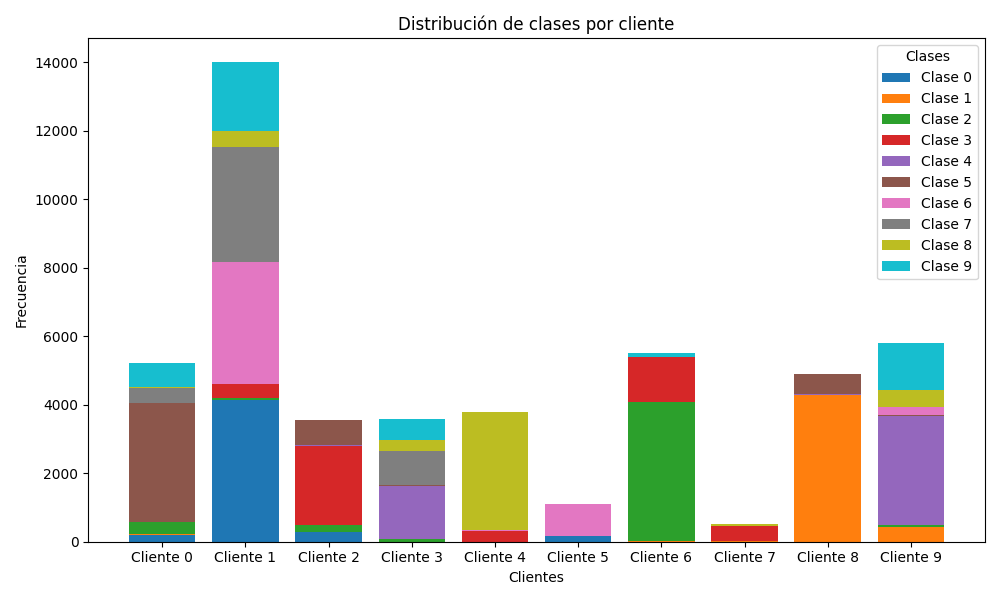
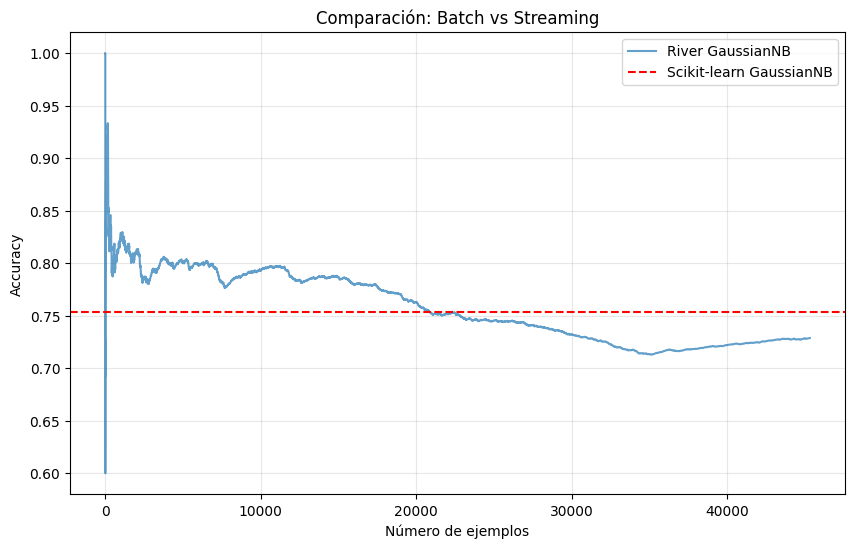
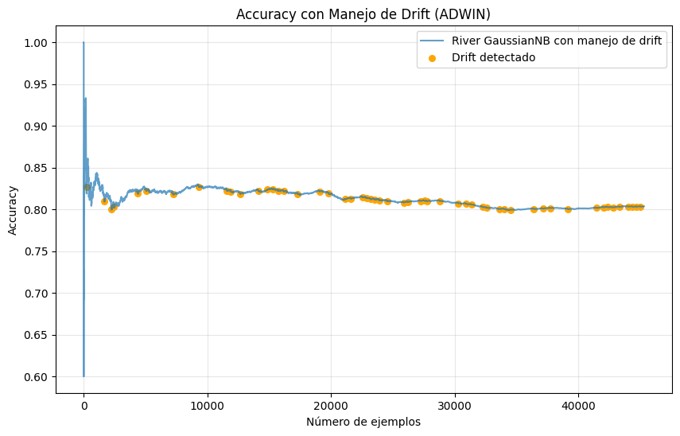
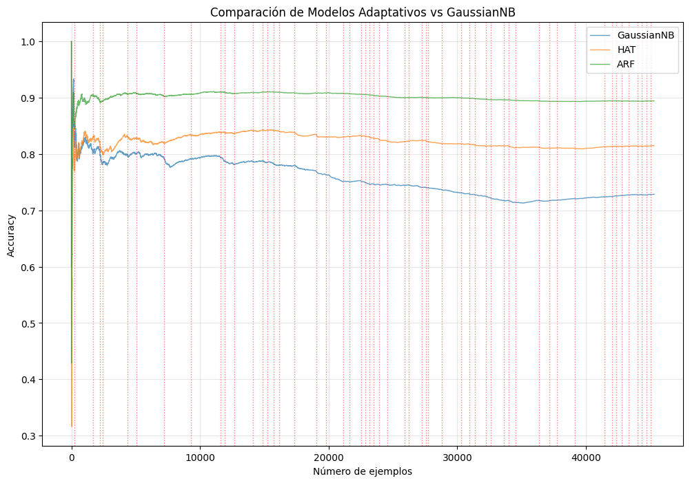

# Parte I: Aprendizaje Federado con Flower

## Implementación

Para llevar a cabo los ejercicios de la Parte I de la práctica, se ha partido de los archivos utilizados en el seminario de Aprendizaje Federado con Flower y PyTorch.

A partir de estos archivos se han realizado las siguientes modificaciones, por orden:

1. Establecido el número de clientes en 10.

2. Adaptada la función de transformación de las imágenes del archivo `task.py` según las estadísticas concretas del dataset FashionMNIST.

3. Editado el particionado para utilizar un particionado basado en distribución Dirichlet con $\alpha \leq 0.1$ en la función `load_data` del archivo `task.py`.

4. Creado un nuevo archivo `histogramas.py` para generar un histograma que muestre la distribución de clases en cada cliente. El histograma resultante se puede ver en la Figura 1. En la entrega se pueden encontrar histogramas individuales para cada cliente.

5. Construida una nueva clase `MLPSimple` en el archivo `task.py`, que define un modelo de red neuronal simple.

6. Implementados los métodos FedAvg y FedProx en el archivo `server_app.py`.

    - Para el caso de FedProx, se ha considerado un valor base de $\mu = 0.01$ y se ha adaptado el archivo `pyproject.toml` para despues poder experimentar con esta variable ([*Paper de referencia*](https://arxiv.org/abs/1812.06127)).

7. Creada una nueva función `plot_metrics` en el archivo `metrics.py` para generar gráficas comparativas de las métricas obtenidas en las distintas experimentaciones.

A continuación, se ha procedido ha realizar las experimentaciones necesarias para responder a las preguntas de análisis propuestas.

El apartado 2.4 ha requerido la creación de un nuevo modelo CNN, el cual se ha definido en el archivo `task.py` bajo la clase `CNNModel`. Se ha entrenado este modelo utilizando tanto FedAvg como FedProx, y se han recogido las métricas correspondientes para su posterior análisis.

Tal y como se menciona en el README, se ha llevado a cabo un proceso importante de optimización de los códigos de manera que no sea necesario adaptar los scripts principales para cada experimento.
Esto ha conllevado la creación de diferentes archivos .toml para gestionar la ejecución de los experimentos.

## Experimentación

## Preguntas de análisis

### 1. Diferencias observadas entre los métodos. Explicar por qué aparecen.
 
### 2. Analizar el impacto de hiperparámetros propios de FL: número de épocas locales, proporción de clientes seleccionados por ronda, etc.

\newpage

# Parte II: Aprendizaje Continuo con River

En esta parte de la práctica, se trabajará con el dataset de *Electricity*, el cual tiene 45312 instancias y 8 atributos. El objetivo es predecir si el precio de la electricidad subirá o bajará en función de los atributos disponibles. A continuación, se describen las distintas experimentaciones realizadas con modelos de aprendizaje para *data streaming*.

## De *batch* a *streaming*

En primer lugar, se entrenará el modelo ***Gaussian Naive Bayes*** utilizando la librería `scikit-learn` en un enfoque de *batch learning*. Pero antes, fue necesario convertir el dataset a un *array* de NumPy y dividir en conjunto de entrenamiento (70%) y de test (30%). La evaluación del modelo tuvo como resultado una precisión del **75.39%**.

A continuación, se implementó el mismo modelo utilizando la librería `River`, que está diseñada para el aprendizaje continuo. El modelo fue entrenado de manera incremental, procesando una instancia a la vez y evaluando su precisión después de cada instancia. El modelo alcanzó una precisión final del **72.87%**, ligeramente inferior al enfoque de *batch learning*, posiblemente debido a la naturaleza secuencial del aprendizaje continuo, como se puede observar en la Figura xxx.

## Manejo de *concept drift*

Para abordar el *concept drift*, se creó un detector de cambios utilizando el **método ADWIN** (Adaptive Windowing). Este detector monitorea el rendimiento del modelo y ajusta su ventana de datos cuando detecta un cambio significativo en la distribución de los datos. A medida que van llegando los datos, se evalúa el rendimiento del modelo y si la predicción del dato actual es incorrecta, se actualiza el detector ADWIN con un valor de 1; si es correcta, se actualiza con un valor de 0. Cuando ADWIN detecta un cambio, se reinicia el modelo para adaptarse a la nueva distribución de datos.

En la Figura xxx se puede observar cómo el modelo maneja el *concept drift*, detectando 54 cambios a lo largo del flujo de datos y estabilizándose a lo largo del flujo, al contrario que el modelo anterior que presentaba más fluctuaciones en su precisión. El modelo con manejo de *concept drift* alcanzó una precisión final del **80.37%**.

## Modelos adaptativos

Finalmente, se implementaron dos modelos adaptativos: un ***Hoeffding Adaptive Tree*** (HAT) y un ***Adaptive Random Forest*** (ARF). Ambos modelos están diseñados para adaptarse automáticamente a los cambios en la distribución de los datos sin necesidad de reiniciar el modelo manualmente. Los dos modelos fueron entrenados y evaluados de la misma manera que el modelo ***Gaussian Naive Bayes*** de *streaming*.

El modelo HAT obtuvo una precisión final del **81.50%**, mientras que el modelo ARF alcanzó una precisión del **89.43%**. La Figura xxx muestra la comparación de precisión entre los tres modelos de aprendizaje continuo, destacando la superioridad del modelo ARF en este caso.

## Preguntas de análisis

### 1. **Justificar por qué un modelo adaptativo como HAT o ARF tiende a superar a GNB en presencia de cambios conceptuales.**

Los modelos adaptativos como HAT o ARF superan a GNB en presencia de cambios conceptuales debido a que tienen enfoques distintos en su diseño. La principal diferencia es que GNB se entrena suponiendo estacionariedad en los datos, es decir, que la distribución de probabilidad P(X|Y) no cambia con el tiempo. Por lo tanto, cuando ocurre un cambio conceptual, no será capaz de detectarlo, por lo que su rendimiento se irá degradando a medida que los datos cambien.

Por otro lado, los modelos adaptativos incorporan mecanismos de detección y adaptación que permiten darle más importancia a los datos recientes. En la pregunta siguiente se entrará en más detalles sobre como funcionan HAT y ARF, pero en resumen, ambos modelos pueden ajustar su estructura y parámetros en respuesta a los cambios en la distribución de los datos, lo que les permite mantener un rendimiento más alto en presencia de *concept drift*, como se puede apreciar en la Figura 3.

### 2. **Explicar por qué ARF suele ser más robusto que HAT. Comentar el papel de los árboles adaptativos, las ventanas y la sustitución dinámica de modelos.**

ARF suele ser más robusto que HAT debido a que HAT es un solo árbol de decisión, mientras que ARF es un *ensemble* (*random forest*) compuesto por múltiples árboles adaptativos. HAT implementa detectores de *drift* como ADWIN a nivel de nodo del árbol, reemplazando subárboles cuando dejan de ser relevantes. Aunque esto le permite adaptarse a cambios locales en la distribución de los datos, sigue siendo vulnerable a cambios globales que afectan a toda la estructura del árbol.

En contraste, ARF utiliza múltiples árboles adaptativos, cada uno entrenado en una muestra diferente de los datos, con su propio detector de *drift* y con diferentes configuraciones. Esto introduce diversidad en el *ensemble*, lo que mejora la capacidad de generalización y robustez frente a cambios conceptuales. En este caso, las ventanas deslizantes operan a múltiples escalas temporales, permitiendo que cada árbol se especialice en patrones a corto, medio o largo plazo.

Por último, la sustitución dinámica de modelos en ARF permite reemplazar árboles completos que se vuelven obsoletos debido a cambios significativos en los datos, manteniendo así un conjunto de modelos actualizados y relevantes. Todas estas características combinadas hacen que ARF sea más robusto y efectivo en comparación con HAT, teniendo en nuestro caso casi un 10% de mejora en precisión.
